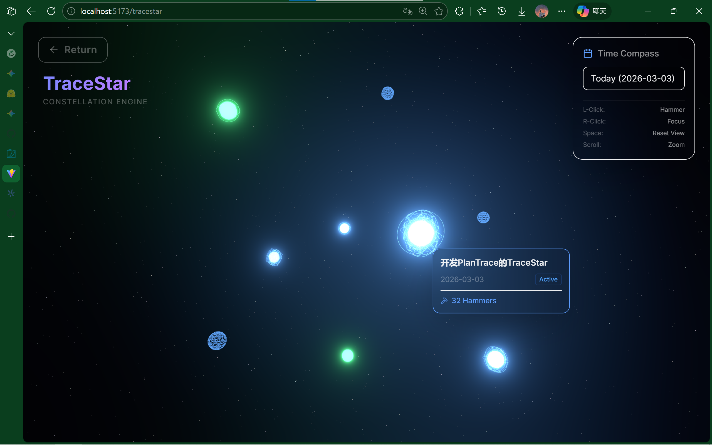
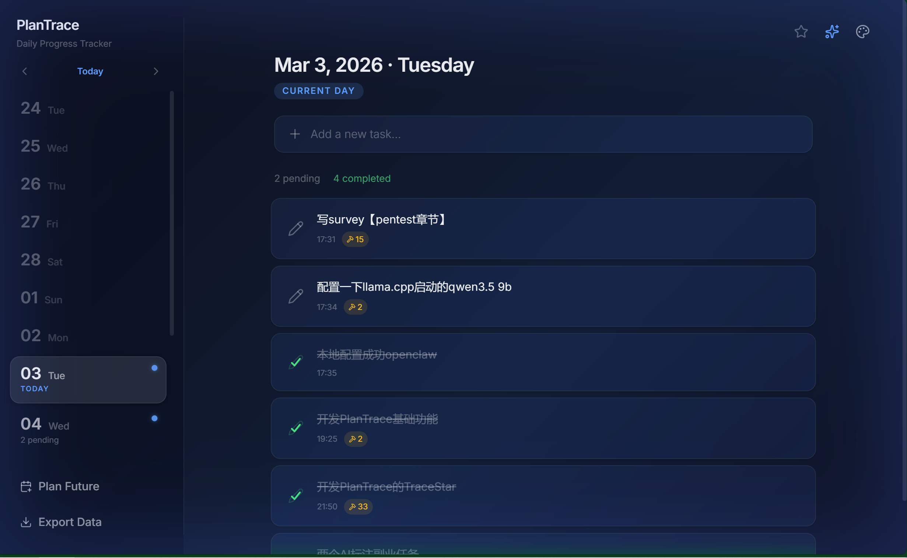
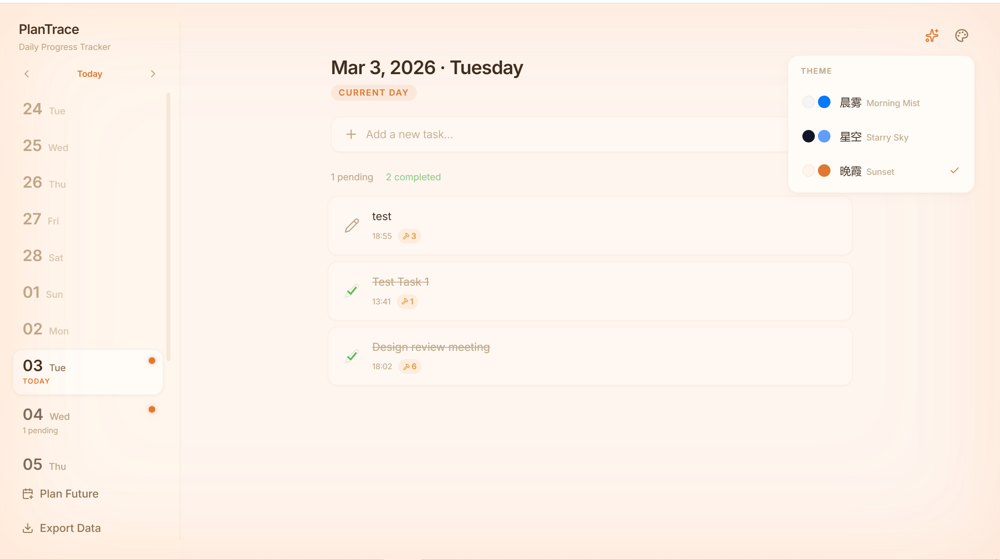

# PlanTrace ✦ 每日待办与进度追踪可视化

> A minimalist daily todo & progress tracker with event-sourcing architecture.
>
> 一个基于事件溯源架构的极简每日待办与进度追踪应用。


---

## 📸 Screenshots | 应用截图







---

## ✨ Features | 核心功能

| Feature | Description |
|---------|-------------|
| **Add / Delete** | Create tasks on any date panel. 可在任意日期面板新增或删除待办。 |
| **Complete** | Mark tasks done — restricted to today only (UTC+8). 完成待办——仅限北京时间当日操作。 |
| **Hammer** | Record effort on a task without completing it. Unlimited daily hits. 敲打进度——记录今日投入精力，每天可无限次。 |
| **Rollover** | Auto-detect pending tasks from the past 7 days and inherit them to today. 跨日继承——自动检测过去 7 天未完成项并弹窗勾选继承。 |
| **Plan Future** | Schedule tasks on any future date via a date picker modal. 规划未来——通过日期选择器在任意未来日期新增待办。 |
| **Export Backup** | One-click export all data to `backups/` as a dated JSON file. 导出备份——一键导出所有数据到项目 `backups/` 目录。 |

---

## 🏗️ Architecture | 数据架构

PlanTrace uses an **Event Sourcing** pattern. All data lives in the browser's **LocalStorage**, separated into two independent tables:

PlanTrace 采用 **事件溯源 (Event Sourcing)** 模式，所有数据存储在浏览器 **LocalStorage** 中，严格分离为两个独立集合：

### Table A — Tasks（任务池）

Stores task metadata and current status. Used for fast UI rendering.

```json
{
  "id": "task_1709424000_abc123",
  "content": "Task description",
  "status": "pending | completed | deleted",
  "created_at": 1709424000000,
  "active_dates": ["2026-03-01", "2026-03-02"]
}
```

### Table B — ActionLogs（动作日志池）

Every user action **appends** an immutable log entry. Logs are **never modified or deleted**.

每次用户操作都会**追加**一条不可变日志，日志**永远不会被修改或删除**。

```json
{
  "log_id": "log_8899aabb",
  "task_id": "task_1709424000_abc123",
  "action_type": "CREATE | COMPLETE | HAMMER | ROLLOVER | DELETE",
  "target_date": "2026-03-02",
  "timestamp": 1709456789123
}
```

> [!NOTE]
> All date/time logic strictly enforces **Beijing Time (UTC+8)**.
>
> 所有日期和时间逻辑强制使用**北京时间 (UTC+8)**。

---

## 🎨 Design | 设计美学

- **Glassmorphism** — Frosted glass cards with `backdrop-blur` and translucent borders
- **Gradient Background** — Animated deep blue/purple mesh gradient
- **Glowing Dots** — Soft neon status indicators on each date card:
  - 🟢 Green = all tasks completed（全部完成）
  - 🔵 Blue = has pending tasks（有待办）
  - ⚪ Grey = past date with unfinished tasks（历史未完成）
- **Pen → Checkmark** — Pending tasks show a pen icon; completing draws an animated checkmark
- **Hammer Animation** — Shake animation on each hammer hit with count badge

---

## 🚀 Quick Start | 快速启动

```bash
# 1. Install dependencies | 安装依赖
npm install

# 2. Start dev server | 启动开发服务器
npm run dev

# 3. Open in browser | 浏览器打开
#    → http://localhost:5173/
```

---

## 📁 Project Structure | 项目结构

```
PlanTrace/
├── index.html                  # Entry HTML with Inter font
├── vite.config.js              # Vite + React + Tailwind + Backup plugin
├── backups/                    # Exported JSON backups (auto-created)
└── src/
    ├── main.jsx                # React entry point
    ├── App.jsx                 # Root component & state management
    ├── index.css               # Design system (gradient, glass, animations)
    ├── store/
    │   ├── dateUtils.js        # Beijing timezone (UTC+8) utilities
    │   ├── storage.js          # LocalStorage wrapper + export backup
    │   ├── taskStore.js        # Tasks CRUD (writes ActionLogs on every mutation)
    │   └── actionLogStore.js   # Append-only immutable action logs
    └── components/
        ├── Sidebar.jsx         # Date cards, glow dots, navigation
        ├── Toolbar.jsx         # Date header + add task input
        ├── TaskItem.jsx        # Task row (pen/check icon, hammer, delete)
        ├── TaskList.jsx        # Sorted task list with empty state
        ├── RolloverModal.jsx   # Inherit past pending tasks to today
        └── PlanFutureModal.jsx # Schedule tasks on future dates
```

---

## 🔧 Tech Stack | 技术栈

| Layer | Technology |
|-------|-----------|
| Framework | React 18 |
| Build Tool | Vite 7 |
| Styling | Tailwind CSS v4 |
| Icons | Lucide React |
| Storage | LocalStorage (Event Sourcing) |
| Typography | Inter (Google Fonts) |

---

## 📦 Data Backup | 数据备份

Click **Export Data** in the sidebar to save a backup:

点击侧边栏 **Export Data** 按钮即可导出备份：

```
backups/plantrace_backup_2026-03-03.json
```

The file contains both `tasks` and `actionLogs` arrays, timestamped with Beijing time.

备份文件包含 `tasks` 和 `actionLogs` 两个完整数组，文件名使用北京时间日期。

---

## 📄 License

MIT
