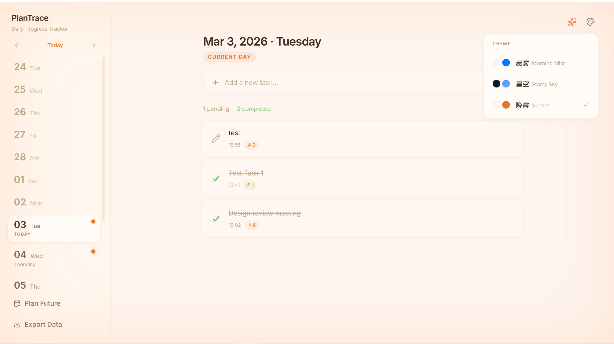
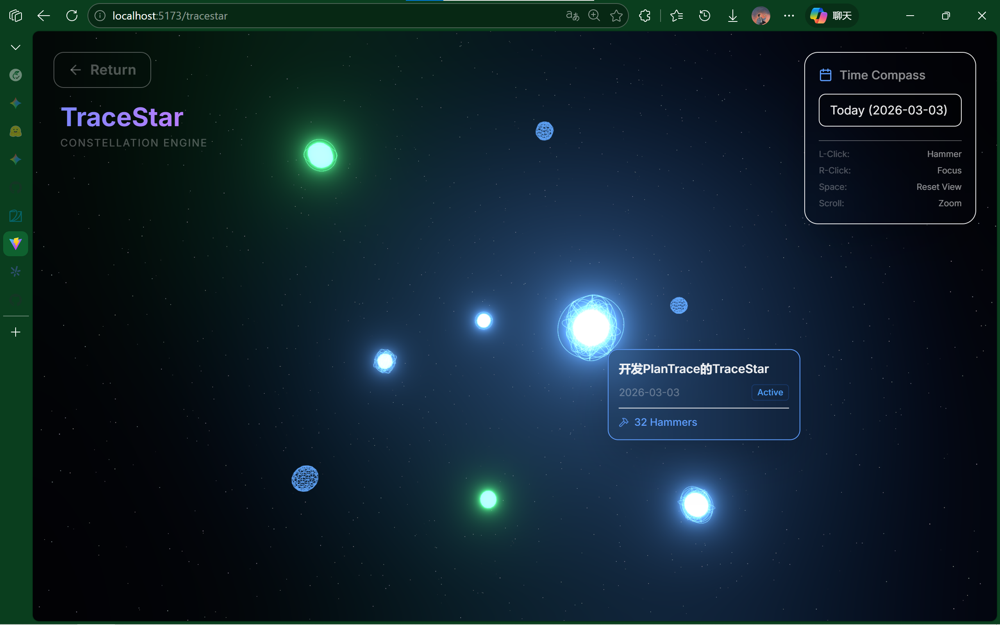
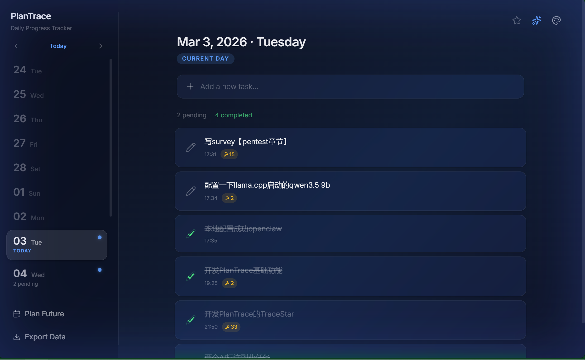

# PlanTrace ✦ 个人任务 · 日记 · 时间追踪

> 一款基于事件溯源架构的精美本地任务管理应用，集成原子时钟、日记、周日程可视化。
>
> A beautiful local-first task manager with atomic timer, diary, and weekly schedule visualization.


---

## 📸 界面截图

| 主界面 | TraceStar 星图 |
|--------|---------------|
|  |  |



---

## ✨ 核心功能

### 📋 任务管理

```
今日任务面板
├── ➕ 添加任务          任意日期可新建待办
├── ✅ 完成任务          仅限北京时间当日操作
├── 🔨 Hammer 打卡       记录投入精力（不完成），每天无限次
├── ✏️ 编辑任务名称      双击行内编辑
├── 🗑️ 删除任务
├── 🔄 跨日继承 Rollover  自动检测过去7天未完成项，弹窗勾选继承
└── 📅 规划未来          通过日期选择器在任意未来日期新增待办
```

### ⚛️ 原子时钟（专注计时）

```
原子时钟卡片
├── 自定义时长（支持输入任意分钟数）
├── 模拟钟表指针实时倒计时动画
├── 结束时系统通知提醒（需要页面权限）
├── 今日累计专注次数 & 历史面板
└── 历史数据按日期正确读取（切换侧栏日期互不干扰）
```

### 📔 日记（本地文件存储）

```
日记功能
├── 主日记栏：自由编辑文本，随主题色变化
├── 碎碎念：带颜色标签的独立随笔块
│   ├── 8种颜色可选
│   ├── 成立时间精确记录（只显示，不可修改）
│   └── 内容随时可编辑
├── 紧凑浮窗 ↔ 全屏双栏 随时切换
├── 800ms 防抖自动保存
└── 存储到用户自选本地文件夹（File System Access API）
    每日文件：diary-YYYY-MM-DD.json
```

### 📅 周日程视图

```
周日程
├── ⏱ 日程模式：展示所有 Hammer 记录时间块
├── ⚛ 原子模式：展示每日专注时间段
├── 自适应时间纵轴（只显示有事件的区间，向外各扩1小时）
├── 重叠时间段自动并列显示（贪心 Lane 算法）
├── 每日 & 全周总时长统计
└── 上下周导航 / 回到本周
```

### 🌟 TraceStar 星图

3D 星空可视化，每颗星代表一个任务的投入历史——任务越活跃，星越亮。

### 🧭 新手指引

首次启动自动展示轻量引导，帮助新用户快速理解任务、Hammer、原子时钟、日期光点、日记、周视图和 TraceStar。引导卡片会展示实际 UI 的缩略示意，右上角 `?` 图标可随时重新打开。

### 🔔 版本更新

```
更新机制
├── 启动后1秒自动静默检查（5秒超时，不阻塞使用）
├── 24小时内只检查一次
├── 发现新版本 → 弹出更新卡片（版本对比 + 更新内容）
├── 一键更新：自动下载、解压、替换代码文件、npm install
│   全程实时进度日志展示
└── 可跳过指定版本（永不再提示该版本）
```

---

## 🚀 安装与启动

### 方式一：一键安装（推荐新用户）

Windows 双击 `Install-PlanTrace-From-GitHub-Windows.bat`

macOS 双击 `Install-PlanTrace-From-GitHub-macOS.command`

**全自动完成以下步骤：**
1. 检测 Node.js（未安装则自动通过 **winget** 安装 LTS 版本）
2. 从 GitHub 下载最新源码
3. 安装依赖（`npm install`）
4. 创建桌面快捷方式 `PlanTrace.lnk`
5. 自动启动

> [!NOTE]
> **Windows 10 / 11** 通常自带 winget，无需任何手动准备，直接双击即可。
> 极少数情况 winget 不可用时，脚本会自动打开 Node.js 下载页面引导手动安装。
> MacOS可能需要一定的权限设置，这是mac安全机制所必需的。
---

### 方式二：手动安装

```bash
# 1. 克隆仓库
git clone https://github.com/EmoLorry/PlanTrace.git
cd PlanTrace

# 2. 安装依赖
npm install

# 3. 启动（浏览器自动打开）
npm run dev
# → http://localhost:5173/
```

---

### 方式三：双击启动（已安装用户）

Windows 双击项目根目录的 **`start.bat`** 或桌面 **PlanTrace 图标**。

macOS 双击项目根目录的 **`start-macOS.command`** 或桌面 **PlanTrace.command**。

---

## 🔄 更新

| 方式 | 适用场景 |
|------|---------|
| 应用内 `↻` 图标 → 一键更新 | 应用正在运行，最方便 |
| 双击 `Update-PlanTrace-Windows.bat` / `Update-PlanTrace-macOS.command` | 应用未运行，命令行更新 |

两种方式均**自动保护用户数据**，不触碰 `backups/`、`start.bat` 及浏览器 localStorage。

---

## 🏗️ 数据架构（Event Sourcing）

所有数据存储在浏览器 **LocalStorage**，严格分离为两个集合：

### Tasks — 任务池

```json
{
  "id": "task_1709424000_abc123",
  "content": "完成论文第三章",
  "status": "pending | completed | deleted",
  "created_at": 1709424000000,
  "active_dates": ["2026-09-18", "2026-09-19"]
}
```

### ActionLogs — 动作日志（只追加，永不修改）

```json
{
  "log_id": "log_8899aabb",
  "task_id": "task_1709424000_abc123",
  "action_type": "CREATE | COMPLETE | HAMMER | ROLLOVER | DELETE",
  "target_date": "2026-09-18",
  "timestamp": 1709456789123,
  "duration_seconds": 3600
}
```

### 原子专注记录

```json
{
  "session_id": "atomic_1726xyz",
  "date": "2026-09-18",
  "label": "深度工作",
  "started_at": 1726650000000,
  "ended_at":   1726653600000,
  "status": "completed"
}
```

> [!NOTE]
> 所有日期和时间逻辑强制使用 **北京时间 (UTC+8)**。

---

## 📁 项目结构

```
PlanTrace/
├── index.html
├── vite.config.js              # Vite + 备份/更新插件
├── public/
│   └── version.json            # 远端版本清单（推送后用于检测更新）
├── backups/                    # 导出的 JSON 备份（自动创建）
├── Install-PlanTrace-From-GitHub-Windows.bat # Windows 一键安装
├── Install-PlanTrace-From-GitHub-macOS.command # macOS 一键安装
├── Update-PlanTrace-Windows.bat        # Windows 一键更新
├── Update-PlanTrace-macOS.command      # macOS 一键更新
├── start.bat                           # Windows 兼容启动入口
├── start-macOS.command                 # macOS 日常启动
└── src/
    ├── version.js              # 本地版本常量
    ├── App.jsx                 # 根组件 & 状态管理
    ├── index.css               # 设计系统（毛玻璃、渐变、动画）
    ├── store/
    │   ├── dateUtils.js        # 北京时间工具函数
    │   ├── storage.js          # LocalStorage 封装 + 导出备份
    │   ├── taskStore.js        # 任务 CRUD（每次操作追加 ActionLog）
    │   ├── actionLogStore.js   # 只追加的不可变日志
    │   ├── atomicStore.js      # 原子专注记录
    │   ├── diaryStore.js       # 日记 File System Access API 封装
    │   ├── versionStore.js     # 版本检测（远端拉取 + 超时 + 冷却）
    │   └── onboardingStore.js  # 新手指引显示状态
    └── components/
        ├── Sidebar.jsx         # 日期卡片、状态点、导航
        ├── Toolbar.jsx         # 日期标题 + 添加任务
        ├── TaskItem.jsx        # 任务行（图标、Hammer、编辑、删除）
        ├── TaskList.jsx        # 任务列表
        ├── AtomicTimer.jsx     # 原子时钟卡片（指针动画）
        ├── DiaryModal.jsx      # 日记弹窗（紧凑/全屏）
        ├── WeekView.jsx        # 周日程时间轴
        ├── UpdateModal.jsx     # 版本更新弹窗（含一键更新进度）
        ├── OnboardingModal.jsx # 首次启动新手指引
        ├── RolloverModal.jsx   # 跨日继承选择弹窗
        ├── PlanFutureModal.jsx # 规划未来日期弹窗
        ├── ThemeSwitcher.jsx   # 主题切换
        └── ThemeContext.jsx    # 全局主题上下文
```

---

## 🎨 设计风格

- **毛玻璃 Glassmorphism** — `backdrop-blur` + 半透明边框卡片
- **多套主题** — 深色/浅色/紫/蓝等，一键切换，全局一致
- **微动效** — 按钮 hover、Hammer 抖动、弹窗弹入、时钟指针流畅旋转
- **状态光点**（侧边栏日期卡）：
  - 🟢 绿 = 当日全部完成
  - 🔵 蓝 = 有待办中任务
  - ⚪ 灰 = 历史未完成

---

## 🔧 技术栈

| 层级 | 技术 |
|------|------|
| 框架 | React 19 |
| 构建 | Vite 7 |
| 样式 | Tailwind CSS v4 + Vanilla CSS |
| 图标 | Lucide React |
| 3D | Three.js + @react-three/fiber |
| 动效 | Framer Motion |
| 存储 | LocalStorage（Event Sourcing）+ File System Access API（日记） |
| 字体 | Inter（Google Fonts）|

---

## 📦 数据备份与安全

```
用户数据存储位置：
├── 任务 / 日志 / 专注记录  →  浏览器 LocalStorage（只在 localhost:5173）
├── 日记文件               →  用户自选本地文件夹（与项目目录无关）
└── 导出备份               →  项目 backups/ 目录
                               plantrace_backup_2026-09-19.json
```

> [!IMPORTANT]
> 更新代码时，以上三处数据**均不会被覆盖或删除**。

---

## 📄 License | 许可协议

本项目基于自定义「**源码可用 · 非商业**」协议开放。

| 允许 ✅ | 禁止 ❌ |
|--------|--------|
| 个人使用、学习、研究 | 商业销售或将本项目用于盈利产品 |
| 修改代码、私有部署 | 将代码包装为商业 SaaS 或付费服务 |
| 在注明来源的前提下分享 | 抄袭代码并声称是自己的原创作品 |
| 衍生作品（须保留许可、注明出处） | 去除版权声明或来源链接 |

> 商业授权请通过 GitHub 联系作者。

© 2026 [EmoLorry](https://github.com/EmoLorry) · [查看完整许可协议](LICENSE)
